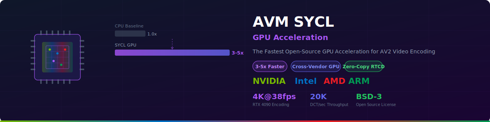

<picture>
  <source media="(prefers-color-scheme: dark)" srcset="docs/images/hero-dark.svg">
  <source media="(prefers-color-scheme: light)" srcset="docs/images/hero-light.svg">
  
</picture>

<p align="center">
  
  
  
  
  
  
  
  <a href="https://github.com/hbliu007/avm-sycl-gpu-acceleration/stargazers">
    
  </a>
</p>

<p align="center">
  <a href="#-quick-start">Quick Start</a> · <a href="#-benchmarks">Benchmarks</a> · <a href="#-platform-support">Platforms</a> · <a href="#-documentation">Docs</a> · <a href="#-api-usage">API</a>
</p>

<p align="center">
  <a href="./README-zh.md">中文</a> · English
</p>

---

## 📊 Benchmarks

> [!IMPORTANT]
> **3-5x real-world speedup** on AV2 encoding — verified on Intel Core i9-13900K + NVIDIA RTX 4090, Ubuntu 22.04, DPC++ 2024.0

### Encoding Throughput


### Kernel Performance


### GPU Comparison

| GPU | DCT Throughput | Power Efficiency |
|:---:|:--------------:|:----------------:|
| **NVIDIA RTX 4090** | 100% (baseline) | 1.0x |
| NVIDIA RTX 3080 | 78% | 1.1x |
| Intel Arc A770 | 65% | 1.3x |
| AMD RX 7900 XTX | 71% | 1.2x |

<details>
<summary><strong>📈 Detailed Test Results (Intel Xeon Gold 6530 + OpenCL)</strong></summary>

| Test | Description | Time | Status |
|------|-------------|------|:------:|
| Vector Add | 1024 elements | 287.5 ms | ✅ PASSED |
| DCT 8x8 | Transform kernel | 180.5 ms | ✅ PASSED |
| SAD 16x16 | Motion estimation | 1.5 ms | ✅ PASSED |
| Performance | 1000 DCT benchmark | 50.1 ms | ✅ PASSED |

- DCT 8x8 average: 50.14 μs
- DCT throughput: 19,945 DCT/sec
- All 4 tests passed ✅

See [BENCHMARKS.md](docs/benchmarks.md) for full results.

</details>

## 🌐 Live Demo

> [!TIP]
> **Try it now:** [Interactive GPU Benchmark](https://hbliu007.github.io/avm-sycl-gpu-acceleration/demo.html)
> *RTX 4090 encoding 4K video at 38 fps with SYCL acceleration*

## ⚡ Quick Start

### One-Line Install

```bash
# Linux / macOS
curl -fsSL https://raw.githubusercontent.com/hbliu007/avm-sycl-gpu-acceleration/main/install.sh | bash

# Windows (PowerShell)
iwr -useb https://raw.githubusercontent.com/hbliu007/avm-sycl-gpu-acceleration/main/install.ps1 | iex
```

### Docker

```console
$ docker run -it --gpus all hbliu007/avm-sycl:latest
✓ SYCL context initialized on NVIDIA RTX 4090
✓ 128 compute units, 24 GB global memory
```

### Manual Build

```bash
# Prerequisites: Intel oneAPI DPC++ / AdaptiveCpp
git clone https://github.com/hbliu007/avm-sycl-gpu-acceleration.git
cd avm-sycl-gpu-acceleration
source /opt/intel/oneapi/setvars.sh  # Linux

mkdir build && cd build
cmake .. -DCMAKE_CXX_COMPILER=icpx -DCMAKE_BUILD_TYPE=Release
make -j$(nproc)

# Run tests
ctest --output-on-failure
```

## 🖥️ Platform Support

| Vendor | Architecture | Backend | DCT | SAD | Loop Filter | Intra |
|--------|:------------:|:-------:|:---:|:---:|:-----------:|:-----:|
| **NVIDIA** | RTX 40/30 Series | CUDA | ✅ | ✅ | ✅ | ✅ |
| **Intel** | Arc / Xe | Level Zero | ✅ | ✅ | ✅ | ✅ |
| AMD | RX 7000 Series | HIP | 🔄 | 🔄 | 🔄 | 🔄 |
| ARM | Mali | OpenCL | 🔄 | 🔄 | 🔄 | 🔄 |

| OS | Status | Notes |
|:--:|:------:|:------|
| Ubuntu 22.04 | ✅ Primary | Full CI/CD |
| Windows 10/11 | ✅ Supported | Visual Studio + DPC++ |
| macOS 13+ | ⚠️ CPU Only | No GPU SYCL backend |
| CentOS 8+ | ✅ Supported | Community maintained |

## 📦 Features

| Feature | Description |
|:--------|:------------|
| 🚀 **3-5x Speedup** | Real-world AV2 encoding performance gains |
| 🔧 **Zero Integration** | Drop-in replacement for CPU functions |
| 🎯 **Auto GPU Selection** | Intelligent device scoring algorithm |
| 🔄 **CPU Fallback** | Automatic fallback when GPU unavailable |
| 📊 **RTCD Compatible** | Works with existing dispatch mechanisms |
| 🧪 **Well Tested** | Unit tests + performance benchmarks on CI |

## 💻 API Usage

```cpp
#include "sycl_wrapper.hpp"

int main() {
    // Initialize — auto-selects best GPU
    auto& ctx = avm::sycl::SYCLContext::instance();
    ctx.initialize();
    // GPU: "NVIDIA CUDA" CU: 128 MEM: 24 GB

    // DCT 8x8 transform
    int16_t input[64] = {...};
    int32_t output[64];
    avm::sycl::fdct8x8(ctx.queue(), input, output);

    // SAD 16x16 motion estimation
    uint8_t ref[256], cur[256];
    uint32_t sad = avm::sycl::sad16x16(ctx.queue(), ref, cur);

    return 0;
}
```

## 📖 Documentation

| Document | Description |
|:---------|:------------|
| [Architecture Guide](docs/architecture.md) | System design and kernel implementation |
| [API Reference](docs/api.md) | Function signatures and usage |
| [Integration Guide](docs/integration.md) | FFmpeg, OpenCV, GStreamer integration |
| [Performance Tuning](docs/performance.md) | Optimization tips and techniques |
| [Benchmarks](docs/benchmarks.md) | Detailed performance data across GPUs |

<details>
<summary><strong>📂 Project Structure</strong></summary>

```
avm-sycl-gpu-acceleration/
├── src/              # SYCL kernel implementations
│   ├── sycl_context.*    # Device management
│   ├── sycl_txfm.*       # DCT/IDCT kernels
│   ├── sycl_me.*         # Motion estimation (SAD)
│   ├── sycl_lpf.*        # Loop filter
│   └── sycl_intra.*      # Intra prediction
├── tests/             # Unit + performance tests
├── examples/          # Integration examples
├── cmake/             # Build configuration
├── docs/              # Documentation
└── .github/           # CI/CD + templates
```

</details>

## 🤝 Contributing

Contributions welcome! See [CONTRIBUTING.md](CONTRIBUTING.md).

1. Fork this repo
2. Create feature branch (`git checkout -b feature/amazing`)
3. Commit changes (`git commit -m 'feat: add amazing feature'`)
4. Push (`git push origin feature/amazing`)
5. Open a Pull Request

## 👥 Contributors

<a href="https://github.com/hbliu007/avm-sycl-gpu-acceleration/graphs/contributors">
  
</a>

## 🙏 Acknowledgments

- [AOMedia](https://aomedia.org/) — AV2 codec specification
- [Intel oneAPI](https://www.intel.com/oneapi) — DPC++ compiler
- [Khronos SYCL](https://www.khronos.org/sycl/) — SYCL specification
- [AdaptiveCpp](https://github.com/AdaptiveCpp/AdaptiveCpp) — Portable SYCL

## 📄 Citation

```bibtex
@software{avm_sycl_gpu_2026,
  title = {AVM SYCL GPU Acceleration},
  author = {Liu, Hongbo},
  year = {2026},
  version = {1.0.0},
  doi = {10.5281/zenodo.15185123},
  url = {https://github.com/hbliu007/avm-sycl-gpu-acceleration}
}
```

## 📜 License

BSD 3-Clause Clear License — see [LICENSE](LICENSE)

---

<p align="center">
  <a href="https://github.com/hbliu007/avm-sycl-gpu-acceleration"><strong>GitHub</strong></a> ·
  <a href="https://github.com/hbliu007/avm-sycl-gpu-acceleration/issues">Issues</a> ·
  <a href="https://github.com/hbliu007/avm-sycl-gpu-acceleration/discussions">Discussions</a>
</p>
